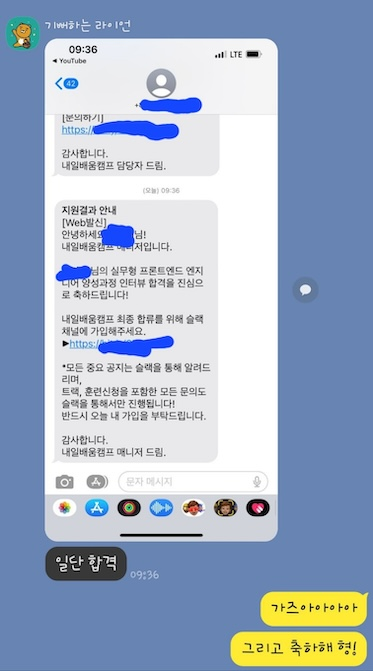
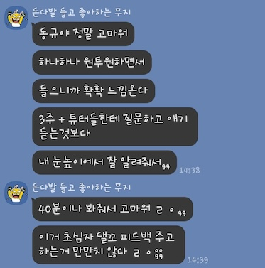

## 멘토링을 하게 된 이유

현업에서 일하고 있던 2022년 12월.

친한 형(이하 '멘티')으로부터 한 통의 전화가 왔습니다. 멘티는 당시 반도체 종사자였고 개발자로의 전향을 진지하게 생각하고 있어 약 2시간가량 대화를 나눴습니다. 전화 통화가 끝난 이후에 3달 동안 저와의 커피챗을 3번 정도 가졌고 그는 개발자의 길을 걷기로 결심합니다. 그가 개발자로서의 꿈을 향해 나아가기로 결심한 순간, 그의 미래에 대한 두려움과 불안함을 함께 나누었습니다.

대화를 통해 제가 쌓아온 개발 지식과 경험이 누군가에게 큰 변화를 가져다줄 수 있다는 사실을 깨달았습니다. 그리고 한 사람의 인생에 타인(他人)이 얼마나 크게 개입할 수 있는지를 깨달았습니다. 그의 인생 변곡점일지도 모르는 이 순간을 함께한다는 것이 얼마나 위대한 일인지 그 편린을 들여다본 순간이었습니다.

멘토가 되어 그의 곁에서 도와주며 그가 부트캠프를 졸업할 때까지 함께하겠다고 다짐했습니다. 그것이 바로 멘토링의 시작이었습니다.

그가 부트캠프를 합격하고 비로소 저는 그의 멘토(mentor)가 그는 저의 멘티(mentee)가 되었습니다.

## 공생 관계

> 공생(共生, 영어: symbiosis)은 생물학 관점에서 각기 다른 두 개나 그 이상 수의 종이 서로 영향을 주고 받는 관계를 일컫는다. <cite>[Wikipedia](https://ko.wikipedia.org/wiki/%EA%B3%B5%EC%83%9D)</cite>

### 역지사지

처음 멘토링을 시작했을 때, 내가 가진 지식을 상대방이 이해하기 쉽게 전달하는 것이 어려웠습니다. 제가 알고 있는 모든 지식이 멘티에게 지식을 공유하는 과정에서 너무 먼 미래의 지식까지 섣불리 전달하는 것이 아닌가 하는 의심이 들었습니다.

따라서 멘티를 먼저 이해할 필요가 있다고 생각하여 HTML, CSS, JavaScript를 기초부터 다시 공부해 보기로 결심합니다. 이때 공부하고 있는 현재 지식으로만 모든 것을 판단할 수 있도록 방향성을 정했습니다. 그리고 이 방법을 통해 내 지식을 상대방이 이해하기 쉬운 방식으로 전달할 수 있게 되었습니다.

### 커뮤니케이션

멘토링을 하게 되면서 질의하는 방법이 정말 중요하다고 느꼈습니다. 이건 실무에서도 마찬가지라고 생각합니다. 만약 내가 모르는 것이 있다면 거기서 멈추면 안 됩니다. 최대한 문제를 해결하기 위해 파고들어야 하고 해결할 수 없었다면 최소한 어느 부분에서 무엇이 안 되는지를 파악해야 합니다. 추가로 이를 해결하기 위해 어떤 방법들을 시도해 봤는지도 질의하는 입장에서 알려주면 최고라고 생각합니다.

이러한 질의 방법은 서로 간의 질의응답을 하는 과정을 축소하고 의사결정의 어지러움을 해결합니다. 또한 중복 질의와 불필요한 정보 전달을 방지할 수도 있었습니다. 또한 이러한 질의를 통해 멘티의 개발 실력 향상을 느낄 수 있었다는 것도 좋았던 점이었습니다.

### 상호 성장

멘토와 멘티는 상호적으로 성장할 수 있는 관계여야 합니다. 상호 존중과 배움의 의지가 필요합니다. 멘토는 지식을 가르치며 멘티에게 더 나은 개발자가 되도록 도와주고, 멘티는 열심히 학습하며 질문과 노력을 통해 스스로를 발전시켜야 합니다.

이러한 관계를 통해 멘티는 개발 지식, 오류 해결 그리고 질의할 때의 소통 방법을 알아갔습니다. 멘토인 저 또한 기초 개발 지식을 다시금 탄탄히 쌓을 기회를 갖게 되었고 질문에 대한 답을 역지사지 마음가짐으로 임해야 한다는 것을 알게 되었습니다.

모든 멘토가 멘티로부터 긍정적인 영향을 받는 것은 아닐 수도 있습니다. 제가 멘티로부터 좋은 경험을 얻을 수 있던 이면에는 그의 적극적인 질문 공세가 있어서 가능했던 것 같습니다.

그는 최대한 멘토를 사용하여 자기에게 도움이 되도록 노력했습니다. 평일, 주말, 공휴일 그리고 밤낮을 가리지 않고 궁금증을 해결하기 위해 오프라인, 온라인 환경을 이용해 본인을 성장시켜 나갔습니다.

## 점점점

### 아쉬웠던 점

멘티가 부트캠프를 다니기에 그곳에서 정해놓은 일정을 따라가야 할 수밖에 없는 상황이었기에 기초를 충분히 알려주기에 시간적 압박이 있었다는 점이 너무 아쉽다고 느꼈습니다. 학습곡선이 높은 리액트를 배우기 전에 충분한 JavaScript 지식을 전달해 주고 싶었지만 그러지 못했습니다. 후에 리액트를 학습하는 데 큰 문제는 없었습니다.

너무 완벽하게 알려주려 하는 성향을 갖고 있다 보니 멘티가 버거워했을지도 모르겠다는 생각이 듭니다. 어떻게 보면 아직 멘티의 입장에서 같은 숲과 나무를 바라보고 있지 못하고 있다는 것을 느꼈습니다. 그의 현실적 상황도 생각했어야 했는데 저의 불착 혹은 패착이었다고 생각합니다.

### 부족했던 점

멘토링 막바지에 멘토링과 코드 리뷰는 그렇게 다르지 않다는 것을 깨달았습니다. 코드 리뷰를 할 때는 해결 방법을 알려주는 것보다는 최대한 해결할 수 있는 방법으로 유도하는 것으로 질의응답을 합니다. 그러나 이번 멘토링을 진행할 때 저는 전혀 그렇지 않았습니다. 해결 방법을 찾아서 직접 제시해 주고 멘티를 이해시키도록 돕는 유형의 질의응답이 많았던 것 같습니다.

이러한 해결 방식은 개발자의 문제 풀이 능력에 전혀 도움이 되지 않습니다. 적당한 선을 두고 멘토와 멘티의 관계를 유지한 것이 아니라 문제 푸는 사람과 답지와의 관계였던 것이 아닌가 하는 회의감이 들기도 합니다.

### 좋았던 점

개발자는 실무를 경험하며 성장할 수도 있지만 그 외적으로 성장할 수 있는 요인이 더 많다고 생각합니다. 실무, 사이드 프로젝트, 블로그, 컨퍼런스 참여, 오픈소스 참여 등을 직접 경험해보았지만 1대1 멘토링은 처음이었습니다.

그 어떤 요인들보다 저를 긴장시키게 했고 두려움을 삼키게 하였습니다. 하지만 '쓰면 뱉고 달면 삼킨다'라는 말이 있듯이 생각보다 달고 맛있었습니다. 그동안 코드만 쳐왔던 저에게 있어 새롭고 진귀한 경험이었습니다. 또한 멘티가 부트캠프를 합격하고, 개발 역량을 향상하며, 프로젝트를 완성하는 모습은 멘토로서 큰 보람이었습니다.

6개월간 달려온 저와 멘티의 시간은 정말 유익하고 의미 있었습니다. 가끔씩 전해주는 칭찬은 저를 더 달리게 했습니다!

짧지 않은 시간 동안 포기하지 않고 달려온 멘티에게 감사하단 말을 전하고 싶습니다.

## 마무리

멘토링을 진행하면서 개발자는 2가지 부류로 나눌 수 있다는 것을 알게 되었습니다. 배울만한 점이 있는 개발자와 그렇지 않은 개발자입니다. 배울만한 점이 있는 개발자는 계속해서 성장하기 위해 무언가를 끊임없이 갈망합니다. 그렇지 않은 개발자는 현실에 안주합니다.

멘토가 되어서 끊임없이 되뇌었던 생각은 멘티에게 있어 '배울만한 점이 있는 개발자로 남고 싶다' 였습니다. 설령 제 지식 공유가 100%가 된다고 하더라도 저는 누군가에게는 지식 말고도 그 외적인 면으로도 배울만한 점이 있는 개발자가 되고 싶습니다.

미래의 나는 그런 개발자가 되어있기를 갈망하며 앞으로 나아가겠습니다.
