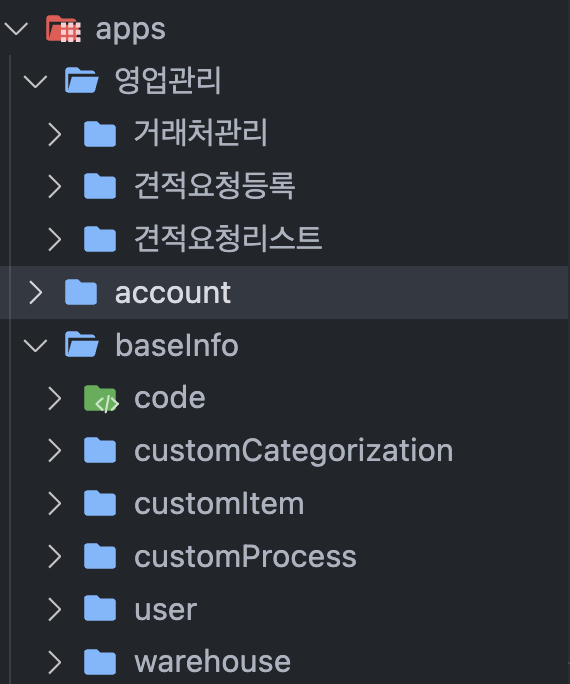

## 프리랜서로의 첫 시작

2023년 5월 6일, 종로 5가의 의류 부자재 유통 회사에서 외주를 시작하게 되었습니다. 당시, 직원분들이 엑셀(Excel)로 재고를 관리하는 탓에 매번 입력 실수와 계산 실수로 인해 금전적인 손해를 보고 있었습니다. 이를 해결하고자 개발팀이 빌딩 되었고 백엔드 1명, PM 1명, 프론트 1명으로 개발을 시작하게 되었습니다. 약 이주 후, 너무 방대한 개발량에 프론트엔드 개발자 한명이 더 합류하여 사내 직원들을 위한 재고 관리 서비스 개발을 본격적으로 시작하게 되었습니다.

## 내가 겪었던 기술적 문제

해당 서비스를 개발하며 겪었던 다양한 기술적 문제 중 가장 기억에 남았던 경험을 공유합니다.

### 순환 참조 문제 해결 전략

재고 관리라는 도메인 아래로 기준정보, 영업 관리, 외주 관리, 구매관리 등의 하위 도메인들이 있고 그 아래로 더 많은 도메인이 존재합니다. 정말 많은 컴포넌트가 만들어졌었고 이는 곧 순환 참조(circular dependency) 문제로 이어졌습니다. 개발 초기에는 순환 참조 문제가 생기더라도 금방금방 해결하였었는데 컴포넌트의 수가 늘어날수록 해당 문제의 원인을 파악하는데 소요되는 시간이 점점 길어졌습니다.

지금 또 이 문제를 해결한다고 하더라도 만약 다시 한번 더 해당 문제가 발생한다면 개발자가 온전히 비즈니스 로직에 신경 쓸 수 있는 시간이 줄어들고 업무에 몰입할 수 없는 환경을 야기시킨다고 생각하였습니다. 이 문제의 근본적인 원인을 파악하여 해당 문제를 해결하려고 했습니다.

`/components`라는 폴더 안에 약 40개의 컴포넌트가 존재했고 `/components/index.ts`에서 모든 컴포넌트를 한꺼번에 export 해주고 있었습니다. 이 파일의 문제점은 상위 모듈에 의존적인 하위 모듈도 배럴 파일에 포함되어 있었습니다. 배럴 파일의 본질적인 목적은 '외부로 모듈을 배출시키는 것'이고 '사용되게 하는 것'이라는 것에 집중하였습니다. 외부로 배출되지 않고 `/components` 내에서만 사용되는 하위 모듈들을 찾아서 `TypeScript`가 불필요한 모듈을 해석하는 일이 없도록 전부 지웠습니다.


너무 방대하고 복잡하게 얽혀있어 동료 개발자와의 상의 끝에 하나의 PR에서 전부 끝내기로 했었습니다. 다행히도 파일 경로 수정에 대한 변경 사항이 많아서 코드 리뷰가 30분 내외로 끝났었습니다.

하지만 아직 순환 참조 문제가 해결되지는 않았습니다. 이번에는 동일한 폴더 계층을 갖고 있는 부모와 자식 관계에 해당하는 컴포넌트들의 계층을 변경하였습니다. `Tab`과 `TabItem`이 동일한 폴더 계층이었다면 `Tab` 아래로 `TabItem`이 들어가게 Top-down 흐름으로 수정되었습니다. 그리고 상위 모듈이 하위 모듈에 최대한 의존적이지 않게 하기 위해 의존성 역전 원칙을 활용하면서 컴포넌트들을 리팩토링하였습니다.

제가 활용했던 의존성 역전 원칙 기반의 설계는 2가지로 구분할 수 있습니다. 첫 번째는 상위 모듈로 구분되는 컴포넌트를 `Context API`의 provider로 감싸고 하위 컴포넌트들을 관리하였습니다. 추상화를 통한 의존성 관리와 결합도 감소는 순환 참조 문제를 해결하기 위해서는 정말 좋은 방법이라고 느꼈습니다. 두 번째는 `children props`를 최대한 활용하여 `A -> B -> C` 구조에서 B가 A에서 C 컴포넌트로 넘겨주는 값에 대한 중개인 역할을 하지 않도록 하였습니다.

예시코드.

```tsx
const SearchBox = ({ children, ...others }: SearchBoxProps) => {
  return (
    <SearchBoxProvider>
      <SearchBoxForm {...others}>{children}</SearchBoxForm>
    </SearchBoxProvider>
  );
};

SearchBox.Select = Select;

export default SearchBox;
```

```tsx
const A = () => {
  const data = useUserList();

  return (
    <SearchBox inputWidth={129} gap={5} buttonSize="sm">
      <SearchBox.Select initialValue="itemCode" data={data} width={110} />
    </SearchBox>
  );
};
```

두 컴포넌트가 포함된 컴포넌트(A)는 자신이 갖고 있는 data를 SearchBox(B)로 전달하지 않고 바로 Select(C)로 전달하고 있습니다.

이러한 해결 과정들을 통해 고질적으로 갖고 있던 순환 참조 문제를 해결할 수 있었습니다. 이후로는 순환 참조 문제가 더는 나타나지 않았습니다.

### 사용자 관점 설계가 필요한 이유

프로덕트를 위한 아키텍처를 처음 설계할 때 개발자 관점에서 기능 중심의 구조를 갖췄습니다. 이러한 구조는 아직 폴더와 파일의 개수가 적고 하위 도메인들을 위한 기능들이 많아지기 전까지는 너무나도 편했습니다.

코드 관리 페이지에서 사용되는 컴포넌트는 `components/code/*`를 보면 됐었고, 유틸 함수는 `utils/code/*`에서 확인하면 됐습니다. 이러한 폴더 구조는 단위가 작은 프로젝트에서는 긍정적인 효과를 볼 수 있겠지만, 단위가 크고 점점 더 확장될 가능성이 있던 재고 관리 프로젝트에서는 불편한 진실을 마주했습니다.

이 프로덕트에는 코드 관리, 사용자 관리, 창고 관리, 품목 관리, 견적품 분류관리, 견적품 공정관리 등등 수십 개의 하위 도메인이 있습니다. 여기서 사용자 관리 페이지와 연관된 기능을 개발하고 있고, 이를 위해 `components/user/*`, `utils/user/*`, `hooks/user/*` 폴더들을 열어놓고 작업하고 있었습니다. 하지만 공통으로 사용되는 API와 관련된 컴포넌트가 있어 코드 관리 페이지와 연관된 폴더들을 여는 순간 sidebar에서 강력한 스크롤 압박이 느껴졌습니다.

그 순간부터 다시 사용자 관리와 관련된 파일을 찾기 위해서는 트랙패드를 열심히 굴리거나 `command + p` 명령어를 사용했었습니다. 한눈에 하나의 도메인과 관련된 기능들을 볼 수 없다는 게 기능 중심 설계의 가장 큰 단점으로 다가왔습니다. 앞으로 프로덕트가 커질수록 '개발자의 기웃거림'이 더욱 심해질 텐데 개발자 경험이 떨어지는 것을 방지하고자 아키텍처 설계에 대해 다시 한번 고민해 보는 시간을 갖게 되었습니다.

직접 만들었던 서비스에 접속하여 이것저것 눌러보던 중에 A 페이지에서는 A 페이지에서 제공하는 기능만 사용하고 있는 저 자신을 발견하게 되었습니다. 그렇다면 A를 도메인이라고 생각하고 도메인 A의 이름을 가진 폴더를 가장 최상위로 올린다는 생각을 갖게 되었습니다. 그러면 도메인 폴더 하나만 열면 해당 도메인과 관련된 모든 파일이 한눈에 들어올 것이라고 확신했습니다.

프로젝트의 루트 경로에 `apps` 폴더를 만들고 하위 도메인으로 한 번 더 분류하였습니다.



하나의 기능을 위해서 만들어졌지만 흩어져 있던 파일들을 사용성에 맞게 분리하였고 '개발자의 기웃거림'은 대폭 감소하게 되었습니다. 이러한 사용자 관점에서 도메인 중심의 아키텍처의 수정은 성능적인 면에서는 변화를 가져오지는 않았지만 개발자 경험 측면에서 충분한 개선점이 되었다고 생각합니다.

지금 와서 보면 정말 간단한 해결 방법이지만 당시에는 3일 동안 고민했었습니다. 이전까지만 해도 개발자가 자신이 직접 만든 프로덕트를 써보면서 개선할 수 있는 것들에는 사용자들을 위한 UX/UI와 각종 버그뿐이라고 생각했었습니다. 그러나 이제는, 아키텍처 개선 과정을 거치면서 사용자 관점에서 프로덕트를 바라보는 것이 사용자 경험만을 향상하는 것이 아니란 것을 알게 되었습니다.

> 개발자 자신도 신뢰성 높은 사용자가 될 수 있으며 사용자 입장에서 프로덕트를 바라보았지만 내부 구조까지 개선할 수 있을 정도의 충분한 영향력을 행사할 수 있다.

제가 이 문제를 해결하면서 얻은 가장 큰 교훈이라고 생각합니다.

## 프리랜서를 경험해 보며 좋았던 점

재고 관리 서비스를 개발하는 팀의 초기 멤버로 참여하게 되어 프로젝트 환경 구축도 혼자 해보고 나중에 합류하신 개발자분과 코드 컨벤션을 맞춰가며 각종 eslint 설정을 덕지덕지 붙였던 경험이 참 즐거웠습니다. 또한 이전 회사에서는 4명이 코드 리뷰를 진행했었는데, 프리랜서 때는 단둘이서 코드 리뷰를 진행하게 되었습니다. 코드 리뷰를 할 사람이 나밖에 없다고 생각하니 부담감이 엄청나게 느껴졌었는데 끝까지 책임지고 서로 리뷰를 남기며 한층 더 성장한 느낌이 들었습니다.

나와 내 팀원이 아니면 이 프로덕트는 절대 완성될 수 없다고 생각하며 프로젝트에 대한 애정을 가지며 개발을 진행했었고 대면 재택 혼합근무도 처음 경험해 봤는데 색달랐습니다. 5일 중 4일을 재택근무를 했었는데, 제 취향은 실제 사람들과 만나면서 개발하는 것이라고 확신했습니다. 매일매일 재택근무를 하는 것이 몸은 편할지언정 개발적인 동기부여를 꾸준히 얻고자 하는 저에게 있어서는 대면 근무가 더 좋다고 생각했습니다. 실제로 경험해 본바, 동료 개발자와 아침 카페에서 만나 커피 한잔을 하며 근무하는 것이 집에서 재택근무를 하는 것보다 더욱 재밌고 활기찬 개발 경험을 선사한다고 느꼈습니다.

해당 서비스를 개발하면서 개발에 대한 몰입이 깨진 적이 거의 없습니다. 물론 개발 환경이 좋아서일 수도 있지만 저는 개발에 대한 자율성이 크게 한 몫을 했다고 생각합니다. 개발하면서 오고 가는 자연스러운 기술적 토론과 긍정적인 피드백, 제한 없는 기술 스택, 자유로운 개발 시간 등이 프로덕트를 만들어 가는데 크게 이바지를 했다고 느꼈습니다.

## 프리랜서를 경험해 보며 아쉬웠던 점

지금까지 경험해 왔던 관리자직들을 위한 엔터프라이즈 서비스에서는 예쁘고 멋진 UI로 개발하지 않고 기능에 초점을 맞춰 간단한 UI로만 개발해 왔습니다. 이 프로젝트를 처음 시작하며 마음먹었던 일이 '나름 멋지고 세련된 UI로 구성된 컴포넌트들을 제공하자!'였는데 결과적으로는 그렇게 되지 못한 게 매우 아쉽습니다. 생각했던 것보다 구현해야 할 기능들이 너무 방대했고 UI의 화려한 모습에 신경 쓸 시간에 하나라도 더 많은 기능을 구현하는 데 시간을 사용했습니다. 추후 다시 한번 관련 서비스를 만들 기회가 생긴다면 다시 도전해 보고 싶습니다.

## 후기

이직 전에 개발을 손에서 놓고 싶지 않아 시작했던 프리랜서 일이 7개월 동안 계속될 줄은 몰랐습니다. 다양한 분야의 분들과 만나게 되고 협업할 수 있게 되어서 정말 좋은 경험을 했다고 생각합니다. 이 경험은 개발적인 면이나 의사소통적인 면이나 저를 한층 더 성장하게 해줬다고 생각합니다.
