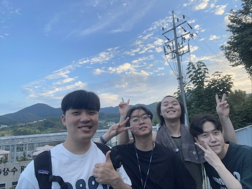
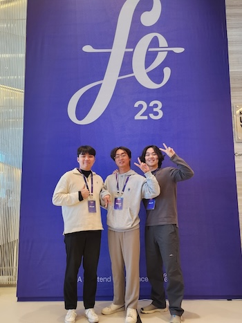
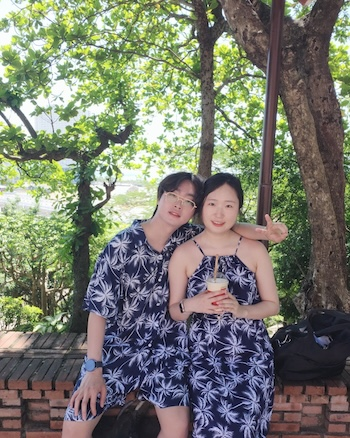

## 서론

퇴사는 많은 이들에게 큰 변화와 결정의 순간이다. 새로운 시작을 의미하기도 하지만, 동시에 익숙했던 환경과 사람들과의 이별을 의미하기도 한다. 그러나 나는 퇴사 후에도 지속되는 관계가 나에게 얼마나 소중한지를 깨닫게 되었다. 이 글에서는 퇴사 후에도 변하지 않는 관계의 중요성과 그 속에서 얻은 소중한 경험을 나누고자 한다.

## 퇴사 전의 동료 관계

처음 입사했을 때, 모든 것이 생소했던 시절에 개발용 맥북을 지급받고 처음 써보는 OS에 버벅거리고 있을 때 동료들의 도움을 받고 굉장히 든든했었다. 뿐만 아니라, 각종 업무 노하우와 회사 문화에 대한 이해를 도와줘서 고마웠지만 굉장히 낯설었던 기억이 난다.

그때 당시 취업했던 회사가 내 생애 첫 직장이었고 나는 취업전까지는 혼자서 개발하는 것에 매우 익숙해져있을 때였다. 그 이유 때문인지, 함께 팀 프로젝트를 진행하면서 코드 리뷰를 통해 피드백을 주고받는 시스템이 굉장히 매력적으로 다가왔었다. 이러한 문화는 개발자로서 부족한 점을 알게 되고 코드를 보는 눈을 기를 수 있었다. 덕분에 시간이 흐를수록 서로간의 믿음과 신뢰가 형성되는 것을 느꼈다.

이를 바탕으로 퇴근 후에는 회사에 남아 같이 개발 공부를 하면서 야식을 먹고 회사에서 자고 바로 출근하는 일상이 몇 개월간 지속되었다. 그렇다보니 서로 개인적인 이야기도 나누게 되고 동료 이상의 깊은 우정이 자연스럽게 생기게 되었다.

이러한 관계는 업무의 스트레스나 힘든 시기를 함께 극복하는 데 큰 힘이 되었다고 장담할 수 있다. 서로의 신뢰를 바탕으로 응원하고 격려해주며, 때로는 서로의 어려움을 함께 나누며 위로해 주었다.

이렇게 퇴사 전의 동료와의 관계는 나에게 소중한 추억과 경험을 직접 겪게 해주었고, 그 관계는 퇴사 후에도 계속 이어졌다.

## 퇴사 후의 변화

퇴사는 익숙했던 일상에서 큰 변화를 가져온다는 말을 너무나도 크게 실감했다. 주기적으로 연락하는 전직장 동료들 중 한 사람과 연인으로 발전하여 행복한 일상을 보내고 있다. 물론 이 이유뿐만은 아니다!

매일 아침 5시 40분에 일어나 3호선 대화역에서 지하철을 타고 2호선 역삼역까지 도착하는 루틴이 사라졌다. 더는 졸린 눈을 비비며 새벽에 일어나지 않아도 되고 출근 시간대의 지하철을 이용하지 않는 점이 퇴사 초기에 너무 좋앗다.

하지만 시간이 지날수록 익숙했던 회사의 경치와 동료들과 나눴던 일상적인 대화들이 떠올랐다. 마음 한켠에 놓인 공백감을 채우기 위해 '2023년 7월'. 그때의 기분을 다시 느껴보고자 프리랜서 일을 시작했다.

시간이 흘러 깨닫게 된 것은 동료들과의 관계가 얼마나 소중한지 알게 되었다는 것이다. 퇴사 후에도 연락을 꾸준히 지속하고 서로의 새로운 일상과 변화를 공유하는 시간을 더욱 소중하게 여기게 되었다.

결국, 퇴사 후의 변화는 새로운 시작과 동시에 기존의 관계를 더욱 깊게 이해하고 소중히 여기게 되는 계기가 되었다.

## 동료와의 우정의 지속

퇴사 후, 많은 것들이 변하게 되었지만, 전직장 동료들과의 우정만은 시간이 흘러도 변하지 않았다. 그 우정은 업무 환경을 넘어서, 일상의 다양한 순간들에서도 계속되었다.

특별한 날이 아니더라도 같이 모여 저녁을 먹기도 하고 운동을 같이 하고 여행도 같이 다녔다.

그리고 시간이 지나면서 서로가 서로에게 부탁하지 않아도 먼저들 나서서 서로를 위해주는 현상들이 나타났다. 이직을 위한 커피챗 제안, 사이드 프로젝트 제안, 멘토링 제안, 운동 코칭, 개발 트렌드 공유, 컨퍼런스 참여 등등 긍정적 회로를 돌릴만한 이야깃거리가 오고갔다.

마치 10년은 만난 친구들과 같은 관계가 된 것 같은 느낌이 들었다. 재밌는 일화로는 1박 2일 여행을 가는 당일날 무려 1시간을 지각한 동료가 있었지만 전혀 화가 안났다. 전화도 받지 않아 직접 집으로 찾아가서 무사히 데리고 갔던 기억이 떠오른다. 그 누구도 그를 탓할 생각보다는 지각을 말미암아 어떻게 장난칠지에 대한 생각으로만 가득 찼던 것 같다.

과거에도, 현재에도, 미래에도 나는 여전히 동료들과 함께 시간을 보내는 것이 즐거웠었고, 즐겁고, 즐거울 것이다.

## 즐거운 동료 관계에서 오는 긍정적 효과

동료 전원이 개발자라는 포지션이다보니 같이 지내면서 배운 점들이 정말 많다. 사람이 살아가는 데 있어서 가장 중요한 것은 주변 환경이 아닌가 싶다. 주변에 코딩에 미친 괴물들만 있다보니 내 몸은 자연스레 그들의 본받을만한 모습을 흡수하기 위해 그들의 행동이나 습관으로 나를 색칠하기 시작했다.

### 색: 개발

첫째, 동료 개발자들이 오픈소스에 자발적으로 기여하고 있는 모습을 보게 되었다. 이를 본 후부터, 깃헙을 탐방하다 마음에 든 레포는 스타를 눌러주고 코드를 뜯어보려 하는 경향이 생기게 되었다. 단순히 공식문서를 본다던가 사용법이 잘 정리되어 있는 블로그를 보는 것도 좋지만 기술의 본질을 파악하는 것은 생각보다 꽤 재밌는 일이다. 또한 다양한 개발자들의 코드를 맛볼 수 있는 가장 쉬운 방법이 아닌가 싶다.

둘째, 개발할 때 손보다 머리를 더 많이 쓰는 모습을 보게 되었다. 이를 본 후부터, 코드 최적화를 최소화하기 위해 처음 코드를 작성할 때부터 심혈을 기울이고 최적화는 필요한 시점에 하려는 경향이 생기게 되었다. 그 전에는, JavaScript와 React를 알게 된 후부터 코드를 한 번 작성하고 최적화를 위해 코드를 여러번 검토하는 방식으로 개발을 즐겨했었다. 하지만 이는 혼자서 개발할 때의 성향이 그대로 묻어나오는 방식이다. 실무에서는 코드 최적화보다는 요청받은 결과물을 데드라인 안까지 만들수 있냐 없냐가 더 중요한 요소라는 것을 잊지 말자.

### 색: 커뮤니케이션

첫째, 육하원칙에 따라서 상세하게 질문을 하는 모습을 보게 되었다. 이를 본 후부터, 질문을 할 때는 상당히 세세하게 물어보려고 하고 중복된 질문이 아닌지 체크하는 경향이 생기게 되었다. 이러한 경향은 협업하는 동료들에게도 꽤 긍정적인 영향을 미친다. 답변을 하는 입장에서 생각의 소모가 줄고 질문자 입장에서 듣고 싶은 답변을 해줄 확률이 높아진다. 또한, 업무의 집중도를 해칠 확률도 대폭 낮아진다.

둘째, 프론트 리드개발자가 회사 대표님과의 상의 끝에 대면재택혼합근무로 전환되는 경험을 겪었다. 이를 본 후부터, 의견 제시를 할 때에는 부정적인 답변이 돌아올 수도 있지만 그래도 해봐야 한다는 것을 배웠다. 하지만 이 경험을 통해 느낀 것은 의견을 제시했을 때 긍정적인 답변이 돌아올 것을 기대한다면 그들간의 신뢰관계가 어떠한지 한번쯤 생각할 필요가 있는 것 같다.

### 색: 동기부여

하나의 길을 보고 언제도착할지 모르는 도착지를 향해 달려가는 동료들의 모습을 보게 되었다.

내 주변에 확고한 목표가 있고 그것만을 위해 달려나가는 사람이 있다면 그것은 정말 큰 행운이다. 그 모습을 본다면 멈추지 않는 지구의 자전처럼 회전하는 열정에 감염되기 마련이다. 열정이 생기면 뭐든 하고 싶어지는데 그 순간을 이용해야 한다. 나에게 생긴 열정은 감염됐기에 언제 치료가 될지 모른다. 이 감염 상태를 유지하려면 계속 달려야만 한다. 나는 이 심지가 계속 불타오르게 유지하고 있고 더는 감염 상태가 아닐지도 모르겠다. 매일매일이 첫 노트를 적는 기분으로 살아가고 있다.

## 마무리

나에게 많은 영감을 준 김민수([Github](https://github.com/minsoo-web)), 박찬혁([Github](https://github.com/okinawaa)), 김규남([Github](https://github.com/k-gn)) 개발자분들에게 감사함을 전합니다.

그리고 항상 제 옆에서 같이 개발하며 도와주는 하정원([Github](https://github.com/JayeHa)) 개발자분에게도 감사함을 전합니다.

당신들과 어깨를 나란히 할 수 있는 개발자가 되기 위해 정진하겠습니다.
